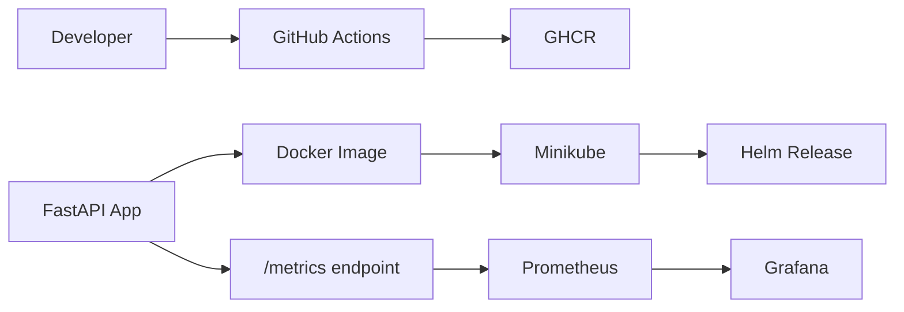

# insiderone-devops-case

## Final project overview
- Small production-minded FastAPI API for the DevOps case study
- Includes Docker, Helm/Minikube, GitHub Actions CI/CD, and local observability
- Keeps the implementation intentionally small and reviewer-friendly

## Architecture summary
- App: FastAPI service with health and metrics endpoints
- Packaging: Docker image with non-root runtime and healthcheck
- Deployment: Helm chart for Kubernetes installation and rollback
- Observability: Prometheus scrapes `/metrics`, Grafana visualizes dashboards



## Endpoints
- `GET /ping` → `{"message":"pong"}`
- `GET /healthz` → `{"status":"ok"}`
- `GET /version` → returns `APP_VERSION` or fallback `local-dev`
- `GET /metrics` → Prometheus metrics

## Local run
```bash
cp .env.example .env
python -m pip install -r requirements.txt
uvicorn app.main:app --host 0.0.0.0 --port 8000 --reload
```

## Docker Compose observability run
```bash
docker compose up --build
```

- App: `http://localhost:8000`
- Prometheus: `http://localhost:9090`
- Grafana: `http://localhost:3000`

## Kubernetes Helm deployment
Build the image used by the chart:

```bash
docker build -t insiderone-api:day1 .
minikube image load insiderone-api:day1
```

Deploy with Helm:

```bash
helm upgrade --install insiderone-api charts/insiderone-api -f charts/insiderone-api/values-dev.yaml
```

Prod-oriented values are also available:

```bash
helm upgrade --install insiderone-api charts/insiderone-api -f charts/insiderone-api/values-prod.yaml
```

## CI/CD summary
- GitHub Actions runs on pull requests and pushes to `main`
- CI installs dependencies, runs `pytest`, builds Docker, runs Trivy, and runs gitleaks
- Release workflow publishes images to `ghcr.io/egedemr/insiderone-devops-case`
- Published tags include `latest` and immutable `sha-...`

## Security summary
- `.env` is gitignored and `.env.example` is the safe template
- Docker runs as a non-root user and includes a `/healthz` healthcheck
- Trivy fails CI on `HIGH` and `CRITICAL` findings
- gitleaks scans the repository for secrets
- `/metrics` is exposed for local/demo observability and should stay internal in real deployments

## Observability summary
- Prometheus scrapes the app at `/metrics`
- Grafana is available locally for dashboard visualization
- Local scrape target is configured as `app:8000` in Docker Compose networking

## Project docs
- [RUNBOOK.md](RUNBOOK.md)
- [SECURITY.md](SECURITY.md)
- [ADRs](docs/adr)

## Final checklist
- [x] Tests
- [x] Docker build
- [x] Helm deploy
- [x] CI green
- [x] GHCR image
- [x] Grafana dashboard
- [x] RUNBOOK
- [x] SECURITY
- [x] ADRs
